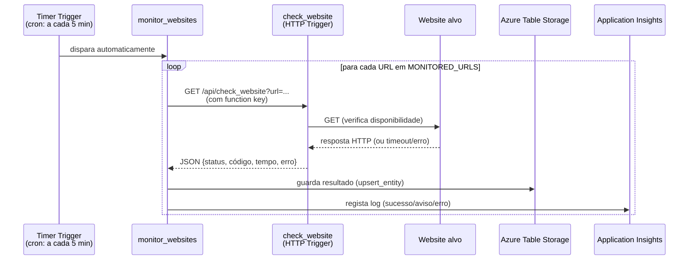
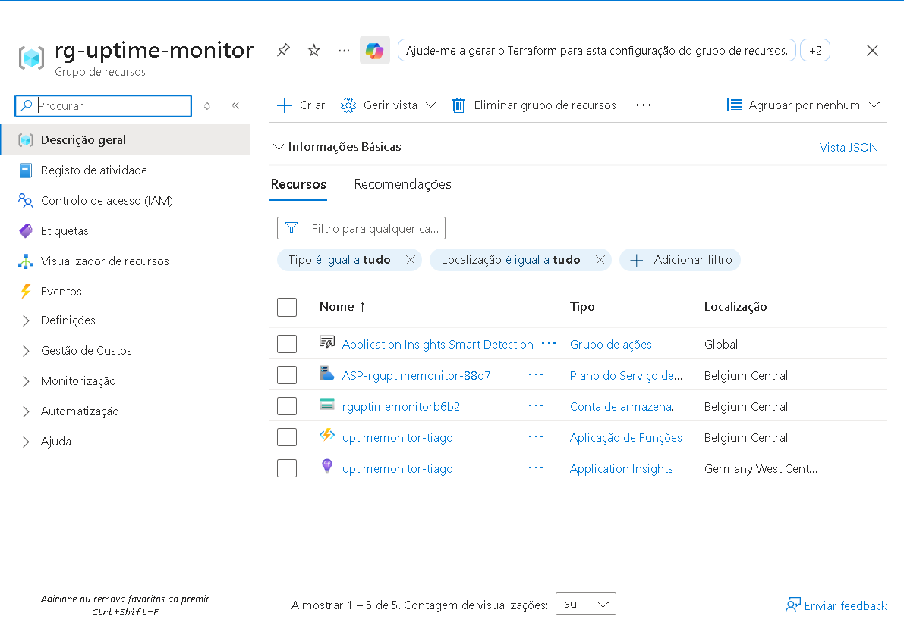
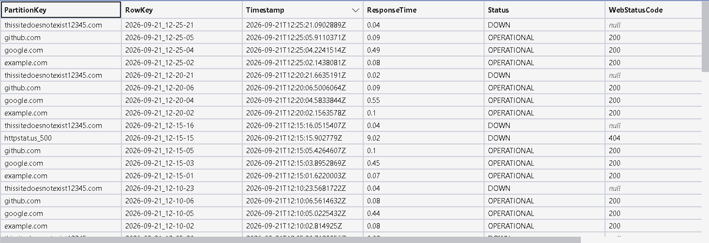
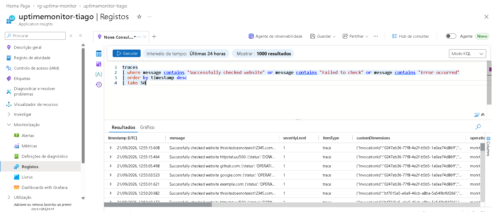

# Website Uptime Monitor

Serviço serverless na Azure que monitoriza a disponibilidade de websites de forma automática e contínua, guardando o histórico de cada verificação para consulta posterior.

Projeto desenvolvido para aprender e demonstrar conceitos fundamentais de **Azure Functions**: HTTP triggers, timer triggers (cron), comunicação entre funções via API, tratamento de erros e logging.

---

## Índice

- [Visão geral](#visão-geral)
- [Arquitetura](#arquitetura)
- [Como funciona](#como-funciona)
- [Recursos de Azure utilizados](#recursos-de-azure-utilizados)
- [Setup — correr localmente](#setup--correr-localmente)
- [Deploy para o Azure](#deploy-para-o-azure)
- [Configuração (Application Settings)](#configuração-application-settings)
- [Exemplos de utilização](#exemplos-de-utilização)
- [Decisões técnicas e desafios](#decisões-técnicas-e-desafios)
- [Possíveis melhorias futuras](#possíveis-melhorias-futuras)
- [Tecnologias utilizadas](#tecnologias-utilizadas)

---

## Visão geral

O projeto tem duas funções principais que trabalham em conjunto:

| Função | Tipo de Trigger | Responsabilidade |
|---|---|---|
| `check_website` | HTTP Trigger | Recebe um URL por parâmetro, verifica se o site está online e devolve o resultado em JSON |
| `monitor_websites` | Timer Trigger (cron) | Corre automaticamente a cada 5 minutos, chama `check_website` para uma lista de sites configurável, e persiste cada resultado numa tabela |

Não é preciso nenhuma intervenção manual — depois de configurado, o sistema monitoriza os sites sozinho, 24/7, e guarda um histórico consultável de disponibilidade ao longo do tempo.

## Arquitetura



Todos os recursos vivem no mesmo **Resource Group**, na região Belgium Central:



- **Function App** (`uptimemonitor-tiago`) — hospeda as duas funções (Linux, plano de Consumo)
- **Storage Account** (`rguptimemonitorb6b2`) — usada pelo runtime das Functions e para guardar o histórico em Table Storage
- **Application Insights** (`uptimemonitor-tiago`) — telemetria e logs centralizados

## Como funciona

### 1. `check_website` — verificação sob pedido

```
GET /api/check_website?url=github.com
```

- Normaliza o URL recebido (adiciona `https://` se não vier especificado)
- Valida o formato do URL com regex
- Faz um pedido HTTP ao site e mede o tempo de resposta
- Classifica o resultado: `OPERATIONAL`, `DOWN`, `INFORMATIVE` ou `UNKNOWN`, consoante o código HTTP devolvido
- Trata falhas de rede (timeout, DNS não resolvido, etc.) sem rebentar, devolvendo `DOWN` com o motivo do erro

Exemplo de resposta:
```json
{
  "status": "OPERATIONAL",
  "web_status_code": 200,
  "response_time": 0.44,
  "error_motive": null
}
```

### 2. `monitor_websites` — automação periódica

- Corre a cada 5 minutos (`schedule="0 */5 * * * *"`)
- Lê a lista de sites a monitorizar da variável de ambiente `MONITORED_URLS`
- Para cada site, chama `check_website` via HTTP (autenticado com a function key, enviada no header `x-functions-key`)
- Regista o resultado nos logs (Application Insights)
- Persiste cada resultado na tabela `WebsiteChecks` do Azure Table Storage

### 3. Persistência do histórico

Cada verificação fica guardada como uma entidade na tabela `WebsiteChecks`:

- **PartitionKey** — o domínio do site (ex: `github.com`), sanitizado (sem `http(s)://` nem `/`, substituída por `_`)
- **RowKey** — timestamp da verificação (`AAAA-MM-DD_HH-MM-SS`), garantindo unicidade e ordenação cronológica
- **Campos**: `Status`, `WebStatusCode`, `ResponseTime`, `ErrorMotive`



Isto permite consultar, por exemplo, todo o histórico de um site específico, ou identificar padrões de indisponibilidade ao longo do tempo.

### 4. Logs e observabilidade

Toda a execução — sucessos, avisos e erros — fica registada no Application Insights, consultável via KQL:

```kql
traces
| where message contains "Successfully checked website" 
   or message contains "Failed to check" 
   or message contains "Error occurred"
| order by timestamp desc
| take 50
```



## Recursos de Azure utilizados

- **Azure Functions** (Python, plano de Consumo, Linux)
- **Azure Storage Account** (usada pelo runtime + Table Storage para histórico)
- **Azure Table Storage** — persistência NoSQL do histórico de verificações
- **Application Insights** — logging e telemetria

## Setup — correr localmente

### Pré-requisitos

- Python 3.9–3.12 (recomendado; versões muito recentes podem não ser suportadas pelo runtime do Azure Functions)
- [Azure Functions Core Tools](https://learn.microsoft.com/azure/azure-functions/functions-run-local)
- [Azurite](https://learn.microsoft.com/azure/storage/common/storage-use-azurite) (emulador local de Azure Storage)
- Uma conta Azure (o projeto foi desenvolvido e testado com uma subscrição **Azure for Students**, gratuita)

### Passos

```bash
# Clonar o repositório
git clone https://github.com/tiagosoliveira2005-cpu/azure-website-uptime-monitor.git
cd azure-website-uptime-monitor

# Criar e ativar um ambiente virtual
python -m venv .venv
.venv\Scripts\Activate.ps1      # Windows (PowerShell)
# source .venv/bin/activate      # macOS/Linux

# Instalar dependências
pip install -r requirements.txt
```

Cria um ficheiro `local.settings.json` na raiz do projeto (**não é versionado no Git**, contém segredos):

```json
{
  "IsEncrypted": false,
  "Values": {
    "AzureWebJobsStorage": "UseDevelopmentStorage=true",
    "FUNCTIONS_WORKER_RUNTIME": "python",
    "MONITORED_URLS": "example.com,google.com,github.com",
    "FUNCTION_APP_BASE_URL": "http://localhost:7071",
    "WEBSITE_FUNCTION_KEY": "",
    "STORAGE_CONNECTION_STRING": "UseDevelopmentStorage=true"
  }
}
```

Num terminal, corre o **Azurite** (emulador local de storage):
```bash
azurite
```

Noutro terminal, corre a Function App:
```bash
func start
```

O timer vai começar a disparar automaticamente a cada 5 minutos, chamando `check_website` para cada site em `MONITORED_URLS` e guardando os resultados localmente no Azurite.

## Deploy para o Azure

```bash
# Autenticação
az login

# Deploy do código
func azure functionapp publish <nome-da-tua-function-app>
```

Depois do deploy, configura as Application Settings equivalentes diretamente no Azure (portal ou CLI — ver secção seguinte).

## Configuração (Application Settings)

| Variável | Descrição | Exemplo |
|---|---|---|
| `MONITORED_URLS` | Lista de sites a monitorizar, separados por vírgula | `example.com,google.com,github.com` |
| `FUNCTION_APP_BASE_URL` | URL base da Function App (usado pelo timer para chamar o `check_website`) | `https://<a-tua-app>.azurewebsites.net` |
| `WEBSITE_FUNCTION_KEY` | Function key do `check_website`, para autenticação entre funções | *(copiada do portal → App keys)* |
| `STORAGE_CONNECTION_STRING` | Connection string completa da Storage Account, para gravar o histórico | `DefaultEndpointsProtocol=https;AccountName=...;AccountKey=...;EndpointSuffix=core.windows.net` |

Via Azure CLI:
```bash
az functionapp config appsettings set \
  --name <nome-da-tua-function-app> \
  --resource-group <nome-do-resource-group> \
  --settings MONITORED_URLS="example.com,google.com,github.com" \
             FUNCTION_APP_BASE_URL="https://<a-tua-app>.azurewebsites.net"
```

> ⚠️ **Nunca** commites o `local.settings.json` nem exponhas as tuas keys/connection strings publicamente — este projeto já inclui um `.gitignore` que as exclui automaticamente.

## Exemplos de utilização

Verificar um site manualmente, via HTTP:
```
GET https://<a-tua-app>.azurewebsites.net/api/check_website?url=github.com&code=<function-key>
```

Resposta:
```json
{
  "status": "OPERATIONAL",
  "web_status_code": 200,
  "response_time": 0.62,
  "error_motive": null
}
```

Site em baixo / URL inexistente:
```json
{
  "status": "DOWN",
  "web_status_code": null,
  "response_time": 0.04,
  "error_motive": "HTTPSConnectionPool(host='...', port=443): Max retries exceeded..."
}
```

## Decisões técnicas e desafios

- **Lógica partilhada via `perform_check`**: em vez de duplicar código de verificação entre o HTTP trigger e o timer trigger, extraí a lógica core para uma função Python "pura" (`perform_check`), reutilizada por ambos os pontos de entrada.
- **Timer a chamar o HTTP trigger via rede (em vez de chamar a função Python diretamente)**: escolha deliberada para praticar autenticação entre serviços via function key e comunicação HTTP real entre componentes — um dos objetivos de aprendizagem do projeto.
- **Sanitização de PartitionKey**: o Azure Table Storage proíbe certos caracteres (`/`, `\`, `#`, `?`) em `PartitionKey`/`RowKey`. Os URLs monitorizados precisaram de ser normalizados (remoção do protocolo, substituição de `/` por `_`) antes de serem usados como chave.
- **Timeouts em cadeia**: como o timer chama o `check_website` via HTTP, e este por sua vez verifica o site real, foi preciso garantir que o timeout do pedido externo (timer → `check_website`) é sempre maior que o timeout interno (`check_website` → site), para não cortar prematuramente verificações a sites lentos.
- **`upsert_entity` em vez de `insert_entity`**: o SDK atual do `azure-data-tables` não expõe `insert_entity`; `upsert_entity` é usado, com `RowKey` baseado em timestamp para garantir que cada verificação gera sempre um registo novo.

## Possíveis melhorias futuras

- Alertas automáticos (email/Teams/Slack) quando um site fica `DOWN`
- Dashboard de visualização do histórico (ex: gráfico de uptime % por site)
- Suporte a verificações mais avançadas (certificados SSL a expirar, tempo de resposta acima de um limite, etc.)
- Testes automatizados (unitários para `perform_check`, `normalize_url`, `is_valid_url`)

## Tecnologias utilizadas

- **Python 3.x**
- **Azure Functions** (HTTP Trigger + Timer Trigger)
- **Azure Table Storage** (`azure-data-tables`)
- **Application Insights** (logging e queries KQL)
- **Azure CLI** / **Azure Functions Core Tools**
- **Azurite** (emulação local de storage para desenvolvimento)

---

*Projeto desenvolvido como exercício de aprendizagem de Azure Functions, APIs, automação (cron) e observabilidade.*
